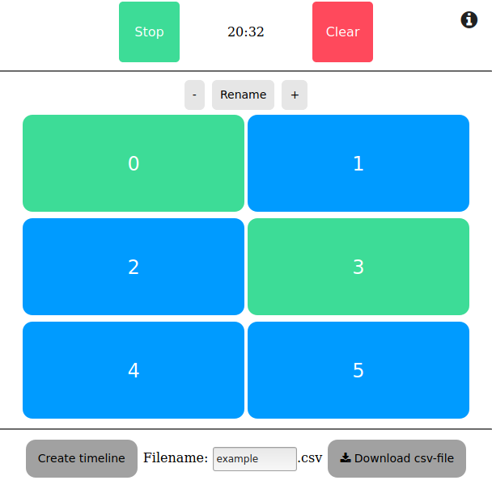

# UPDATE:
New and improved version of the app is called TrackIt and it is availabe at [sciedu.fi/trackit][http://sciedu.fi/trackit]. The code repository is still private, but will made public on a later date.

# LOBS
Lesson OBServation app
The LOBS app used in educational research. The app is simple stopwatch to keep track of activities taking place in a classroom or similar setting.

__Please note,__ I'm no developer so the code might be bit shoddy, but it works just fine for my use. Also, it might contain some oddities or bugs. If you find any, plese report them to me.

Use of this tool should be intuitive, but here's a small description.

* Start/Stop button starts or stops the timer.
* Numbered buttons are toggleable as in you may activate and deactivate them. Doing so saves the current time as start or stop time for that event.
* \+ and - buttons adds and deletes buttons respectively, note that deleting button also deletes saved data for that button.
* rename button allows you to give own names for each button. Names are stored locally and therefore should remain even if the window is closed.
* Create timeline draws simple timeline into a HTML5-canvas from the saved data. At least in firefox it is possible to view the canvas as image by rigth clicking and then save it.
* Is is possible to also download the saved data as csv-file. Note that first row of the file is always "start0, stop0, start1..." and is not affected by renaming the buttons.
* Clear button resets the timer, clears the timeline and deletes all data. However, it does not affect the activation buttons.

I recommend that you do all customization before strating the timer eventhough timer should work dynamically.

Article to be published in: ML proceedings

Miikka Turkkila

This work is licensed under a [Creative Commons Attribution-NonCommercial-ShareAlike 4.0 International License](http://creativecommons.org/licenses/by-nc-sa/4.0/)
